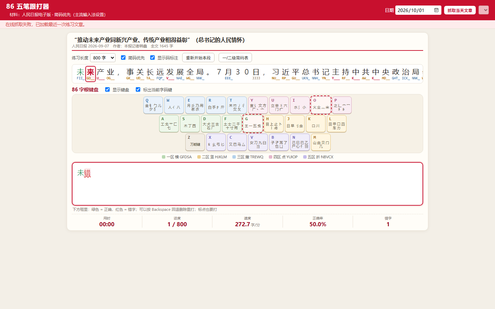

# 86 五笔跟打器（人民日报社评练习）

一个零依赖、只在本机运行的 86 版五笔打字练习工具：自动抓取当天人民日报电子版的
评论/文章作为练习材料，逐字标注五笔码（一级、二级、三级简码齐全），配上字根键盘与实时对错反馈。



> 纯 Python 标准库实现，不需要安装任何第三方库；练习文章只在本地缓存，不入库。

## 功能特性

- **自动抓取最新材料**：从人民日报电子版（`paper.people.com.cn/rmrb/pc`）抓取最近一期内容，
  优先选评论版，其次头版长文；也可按日期选择任意一期的任意文章。
- **完整 86 版标注**：21004 字码表，一级简码 1 键、二级简码 2 键、三级简码 3 键，
  其余取全码；不足四位用 `_` 补齐（如 `产`→`U___`、`来`→`GO__`、`新`→`USR_`）。
- **单行原文 + 三行打字框**：原文只占一行、跟随进度横向滑动，当前字始终居中；
  打字框固定三行高，内容自动滚动，整页一屏放下，无需上下翻页。
- **彩色对错反馈**：打字框内绿色=正确、红色=错字并带波浪线；支持 Backspace 回退删除重打，
  实时统计用时、进度、速度（字/分）、正确率与错字数。
- **86 字根键盘**：屏幕键盘按五区配色，键面印字根；按物理键时对应键发光，
  并把当前字的码键用虚线框标出，方便把“字 → 码 → 字根”对应起来（可关闭提示或隐藏键盘）。
- **简码速查**：内置一级简码 25 键表与二级简码速查表，支持按字或按码搜索。
- **离线可用**：文章与版面缓存到 `data/cache/`，断网时可继续练上一篇内容。

## 数据分析

仓库自带一份对码表的数据分析（[`analysis/`](analysis/README.md)）：统计简码层级分布、
重码结构、25 键位负荷与击键成本，结论包括：

- 21,004 字对应 18,271 个编码，重码字 4,911 个（23.4%），最大重码组 13 字；
- 有简码的字重码率 13.7%，仅为仅全码字（26.6%）的一半，平均击键 2.877 vs 4.000；
- 首键负荷极不均衡：最重的 Q 键 1,791 字，最轻的 B 键 318 字，相差 5.6 倍。

复现：`pip install -r analysis/requirements.txt && python analysis/analyze.py`

## 快速开始

要求：Windows + Python 3.10 及以上（无第三方依赖）。

```text
双击 start.bat
```

或命令行：

```bash
python app.py
```

程序会启动本地服务并自动打开浏览器：<http://127.0.0.1:8765>

- 若 8765 被占用，会自动顺延到 8766、8767……
- 页面打开后，用**本机已装好的五笔输入法**在下方打字框中正常打字即可。

## 使用说明

1. 顶部选择日期，点击「抓取当天文章」，或在下拉框里换一篇；
2. 中间一行是待跟打文字与五笔码标注，红框表示当前该打的字；
3. 再往下是 86 字根键盘，按键会亮，当前字所需码键有虚线提示；
4. 在最下方三行打字框中用五笔输入法打字：绿色正确、红色错误，
   按 Backspace 可回退删除重打，标点也要打；
5. 打完自动显示用时、速度与正确率；可切换练习长度（200/400/800/1200 字或全文）并重新开始。

### 标注规则

| 类型 | 键数 | 示例 |
| --- | --- | --- |
| 一级简码 | 1 键 | `工` → `A___` |
| 二级简码 | 2 键 | `时` → `JF__` |
| 三级简码 | 3 键 | `新` → `USR_` |
| 全码 | 4 键 | `道` → `UTHP` |

- 不足四位一律用 `_` 占位，实际打字不用打 `_`；
- 标注默认「简码优先」，勾掉该选项可只看全码；
- 鼠标悬停在字上会显示该字的全码与简码级别。

## 项目结构

```text
wubi86-genracer/
├─ app.py                  # 本地 HTTP 服务：抓取 + 标注 + 静态页
├─ start.bat               # Windows 一键启动
├─ static/
│  ├─ index.html           # 页面结构
│  ├─ style.css            # 样式（单行原文 / 三行打字框 / 字根键盘）
│  └─ app.js               # 打字判定、对错着色、键盘点亮
├─ data/
│  ├─ wubi86.json          # 86 版单字码表（含一/二/三级简码）
│  └─ jianma.json          # 一级/二级简码速查数据
├─ tools/make_data.py      # 由 pywubi 码表重新生成 data/*.json
└─ docs/
   ├─ screenshot.png
   └─ THIRD_PARTY_LICENSES.md
```

### 重新生成码表

```bash
pip install pywubi
python tools/make_data.py
```

或指定码表文件：`python tools/make_data.py path/to/wubi_86.json`。
码表来源与许可见 [docs/THIRD_PARTY_LICENSES.md](docs/THIRD_PARTY_LICENSES.md)。

## 常见问题

- **抓取很慢或失败**：首次抓取需要请求 20 多个版面页；已做并行抓取并按日期缓存，
  再次打开基本秒开。完全断网时会自动加载最近一次练习文章。
- **想换一篇**：用顶部下拉框选择当天任意版面文章，或改日期重新抓取。
- **想清掉缓存**：删除 `data/cache/` 目录即可，程序会重新抓取。
- **端口冲突**：程序会自动换端口，命令行窗口会打印实际地址。
- **`start.bat` 一闪而过**：请确认已安装 Python 3.10+，或在目录地址栏输入 `cmd`
  后执行 `python app.py` 查看报错。

## 免责声明

- 练习文章在运行时抓取自人民日报电子版，版权归人民日报所有，仅供个人学习、打字练习使用；
  抓取内容只缓存在本机 `data/cache/`，不随仓库分发。
- 本项目与人民日报、五笔字型专利方无任何关联。

## License

[MIT](LICENSE)
