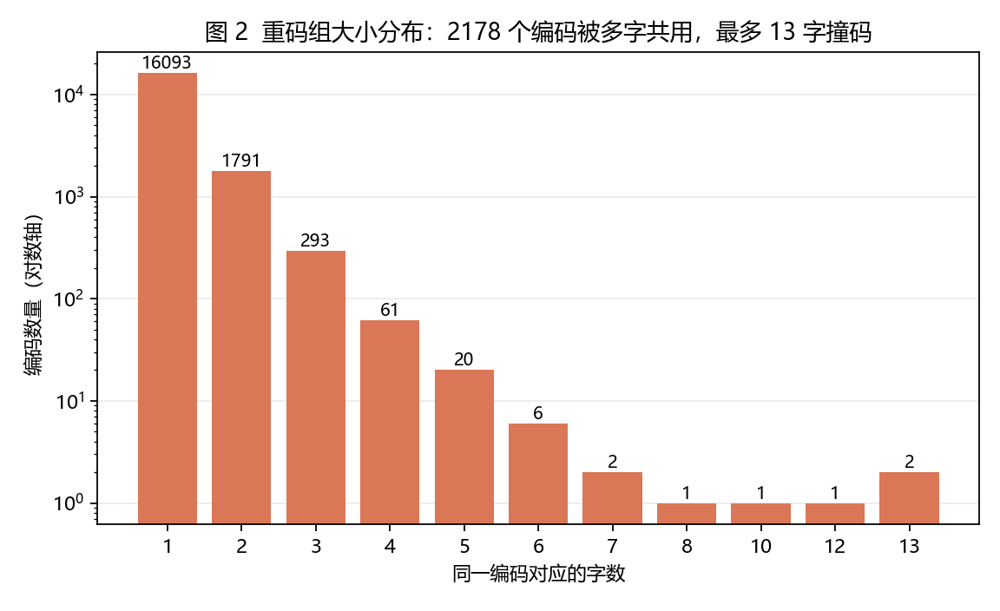
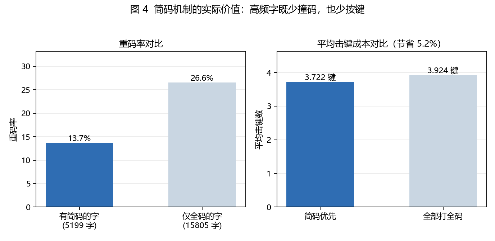
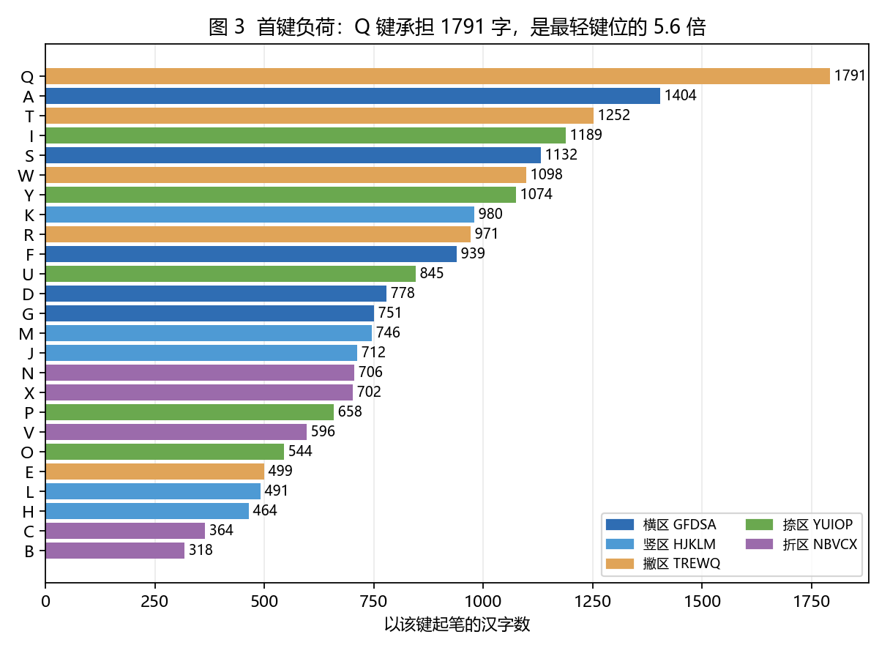
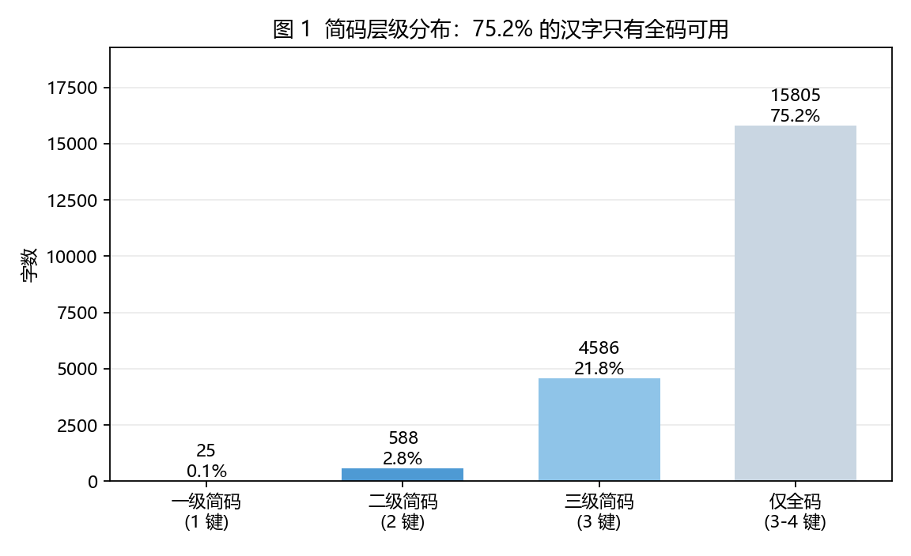

# 五笔 86 码表：重码结构与键位负荷分析

> 本目录是 [86 五笔跟打器](../README.md) 的配套数据分析，所用码表为仓库根目录的
> [`data/wubi86.json`](../data/wubi86.json)。

## 1. 问题

五笔字型用一个 3–4 键的编码表示一个汉字，编码空间有限而汉字有两万多个，必然出现"多个字共用同一个编码"（重码）。本次分析想回答三个问题：

1. 重码到底有多严重，集中在哪些编码上？
2. 简码机制（1/2/3 键）是少数高频字的特权，还是真的改善了整体输入效率？
3. 25 个键位的负荷是否均衡，如果做打字训练或输入法优化，应该从哪里入手？

## 2. 数据与方法

- **数据**：仓库根目录的 `data/wubi86.json`，共 **21,004** 个汉字，每条记录包含主用码 `c`、简码级别 `l`（0 = 只有全码）、全码 `f`
- **方法**：用 Python 对码表做分组聚合——按编码分组统计重码、按简码层级分组统计构成、按首键分组统计键位负荷，并对比"有简码的字"与"仅全码的字"的重码率和击键成本
- **复现**：

  ```bash
  pip install -r analysis/requirements.txt
  python analysis/analyze.py                                   # 使用仓库自带码表
  python analysis/analyze.py --data path/to/wubi86.json        # 或指定其他码表
  ```

  输出 4 张图与本目录下的 `summary.json`。

## 3. 结论

### 3.1 重码是结构性问题，不是个别现象

21,004 个汉字只对应 **18,271 个不同编码**，其中：

| 指标 | 数值 |
|---|---|
| 被多字共用的编码 | 2,178 个 |
| 处在重码中的字数 | 4,911 个（**23.4%**） |
| 最大重码组 | **13 个字**共用同一编码（WYVK、FPGC） |

近四分之一的汉字输入时都会遇到候选选择，最极端的编码要在 13 个字里挑。



### 3.2 简码不是"特权"，而是效率设计

简码层级分布如下：

| 层级 | 字数 | 占比 |
|---|---:|---:|
| 一级简码（1 键） | 25 | 0.1% |
| 二级简码（2 键） | 588 | 2.8% |
| 三级简码（3 键） | 4,586 | 21.8% |
| 仅全码（3–4 键） | 15,805 | **75.2%** |

看起来四分之三的字没有简码，但把两类字分开看，差异非常明显：

| 分组 | 字数 | 重码率 | 平均击键 |
|---|---:|---:|---:|
| 有简码的字 | 5,199 | **13.7%** | 2.877 |
| 仅全码的字 | 15,805 | **26.6%** | 4.000 |
| 全体（简码优先规则） | 21,004 | 23.4% | 3.722 |
| 全体（全部打全码） | 21,004 | 23.4% | 3.924 |

括号里的口径说明：有简码的字按简码优先只需 **2.877** 键，而这些字如果打全码需要 **3.691** 键。

**有简码的汉字，重码率只有仅全码汉字的约一半。** 这符合输入法的设计逻辑：最常用的字被优先分配了短码，同时也被优先做了避重处理。



### 3.3 键位负荷明显不均衡

以首键统计，负荷最高的 Q 键承担 **1,791** 个字，而最轻的 B 键只有 **318** 个，相差 **5.6 倍**。五个区（横、竖、撇、捺、折）之间也存在系统性差异。



这对打字训练的启示是：真正需要练的不是"每个键平均练"，而是把高频首键和字根组合作为专项训练内容。

### 3.4 简码带来的整体击键节省

按"简码优先"规则输入，21,004 个字平均需要 **3.722 键**；如果全部打全码，平均需要 **3.924 键**，节省约 **5.2%**。

这个数字看起来不大，但它是在**字表全集**上算的。真实文章里高频字的比例远高于字表比例，而简码恰好大部分给了高频字，所以实际打字时的节省幅度会明显大于 5.2%——这也是可以继续验证的方向（见第 5 节）。



## 4. 这些结论有什么用

- **对打字练习**：不必平均用力，优先掌握一级/二级简码（613 个字），再按首键负荷排序做字根专项训练
- **对输入法设计**：重码集中在少数编码上（2,178 个编码承担了 4,911 个字的歧义），优化这 2,178 个编码的候选排序，比整体重排码表收益更集中
- **对产品功能**：跟打器可以按"首键负荷"和"是否重码"给用户推荐练习材料，把重码字集中成专项练习

## 5. 局限与后续

1. 本分析基于**字表全集**，没有按真实文章的字频加权。用跟打器缓存的实际文章做加权后，"简码节省击键"的数字会更有说服力。
2. 只分析了单字码表，没有纳入词组编码；词组是五笔回避重码的主要手段之一。
3. 重码率与输入体验之间不是线性关系——候选顺序合理时，重码的代价会显著降低，这一点无法仅从码表推断。

## 6. 文件说明

| 文件 | 内容 |
|---|---|
| `analyze.py` | 完整分析脚本，可指定数据路径复现全部结果 |
| `requirements.txt` | 依赖（matplotlib） |
| `summary.json` | 全部指标的结构化输出 |
| `charts/01_code_level_distribution.png` | 简码层级分布 |
| `charts/02_collision_group_sizes.png` | 重码组大小分布 |
| `charts/03_key_load.png` | 25 键首键负荷 |
| `charts/04_shortcode_value.png` | 简码的字重码率与击键成本对比 |

## 7. 许可

分析代码与图表采用仓库根目录的 [MIT 许可](../LICENSE)；码表数据的来源与许可说明见
主仓库 README 的第三方许可部分。
